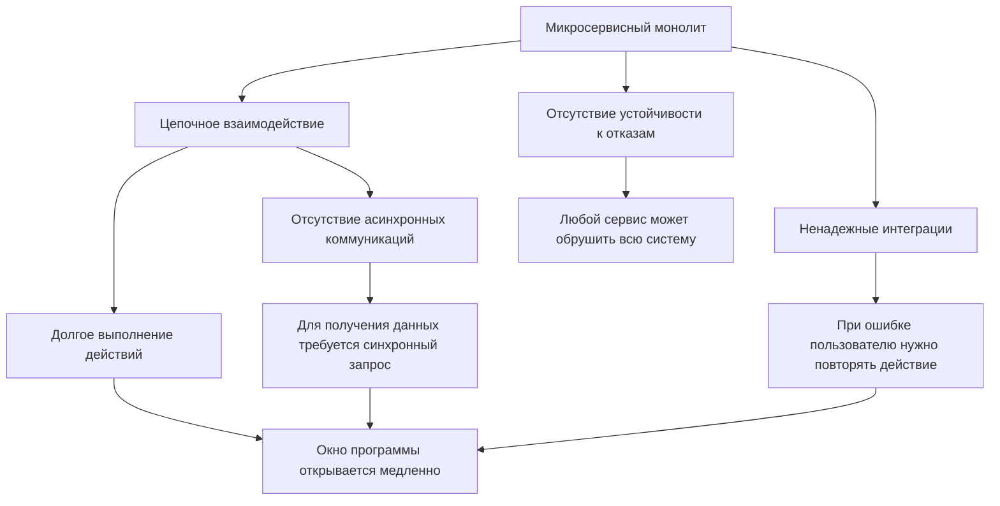

# Микросервисный монолит

Теория Элияху Голдратта, известная как "Теория Ограничений" (Theory of Constraints, TOC), фокусируется на идентификации и устранении бутылочных горлышек в системах для улучшения общего производительности. В контексте микросервисной архитектуры, анализ нежелательных явлений (НЖЯ) позволяет идентифицировать ключевые ограничения и построить связи между ними для оптимизации системы.

## Дерево текущей реальности

### Пояснение

- **Микросервисный монолит (A)** является корневым элементом, который порождает множество других нежелательных явлений.
- **Цепочное взаимодействие (B)** и **Отсутствие устойчивости к отказам (C)** являются прямыми следствиями монолитности.
- **Ненадежные интеграции (D)** также являются следствием монолитности.
- **Долгое выполнение действий (E)** и **Отсутствие асинхронных коммуникаций (F)** являются следствиями цепочного взаимодействия.
- **Любой сервис может обрушить всю систему (G)** является следствием отсутствия устойчивости к отказам.
- **При ошибке пользователю нужно повторять действие (H)** является следствием ненадежных интеграций.
- **Для получения данных требуется синхронный запрос (I)** является следствием отсутствия асинхронных коммуникаций.
- **Окно программы открывается медленно (J)** является следствием долгого выполнения действий, синхронных запросов и необходимости повторения действий при ошибках.

Это дерево текущей реальности помогает визуализировать взаимосвязи между нежелательными явлениями и определить ключевые области для улучшения системы.

### Размышления модели 
Хорошо, я получил список Нежелательных Явлений (НЖЯ) из теории Голдратта, в частности, в контексте системы микросервисного монолита. Мне нужно проанализировать эти НЖЯ и найти связи между ними, используя теорию Голдратта.

Сначала я должен вспомнить пять фокусирующих шагов из Теории Ограничений: идентифицировать бутылочное горлышко, эксплуатировать его, подчинять другие процессы этому ограничению, улучшить бутылочное горлышко и повторять процесс.

Рассматривая первое НЖЯ, систему, являющуюся микросервисным монолитом, можно предположить, что сервисы тесно связаны, что может быть бутылочным горлышком, так как любое изменение влияет на несколько частей.

Второй пункт о взаимодействии сервисов по цепочке означает последовательную зависимость, что может увеличить задержки и стать бутылочным горлышком само по себе.

Третье НЖЯ, где любой сбой сервиса приводит к падению всей системы, указывает на отсутствие избыточности или отказоустойчивости, делая систему хрупкой.

Четвертое, ненадежные интеграции указывают на проблемы в коммуникации между сервисами, возможно, вызывающие потерю данных или ошибки, еще одно бутылочное горлышко.

Долгие времена выполнения операций напрямую влияют на удовлетворенность пользователей и эффективность системы, очевидно, бутылочное горлышко.

Когда возникают ошибки и пользователи должны повторять действия, это добавляет ненужную работу и разочарование, влияя на общую производительность.

Седьмой пункт, где любой сервис может обрушить всю систему, связан с отсутствием изоляции и отказоустойчивости.

Отсутствие асинхронных коммуникаций означает, что сервисы не оптимизированы для параллельной обработки, что приводит к более высоким нагрузкам и потенциальным бутылочным горлышкам.

Необходимость синхронных запросов данных может вызывать задержки и перегрузки, снова указывая на неэффективность системы.

Медленное открытие окна программы влияет на пользовательский опыт и производительность, еще одно бутылочное горлышко в интерфейсе пользователя или процессах получения данных.

Теперь, соединяя эти НЖЯ, кажется, что тесная связь и отсутствие асинхронных коммуникаций являются основными факторами, способствующими большинству этих проблем. Они приводят к бутылочным горлышкам, увеличивают точки отказа и ухудшают производительность.

Для решения этих проблем, согласно теории Голдратта, я должен сначала идентифицировать главное бутылочное горлышко, которое, похоже, является самой структурой микросервисного монолита. Затем, эксплуатировать его, оптимизируя наиболее критичные сервисы, подчинять другие сервисы для поддержки этой оптимизации, улучшить, возможно, путем деконтаминации сервисов, и повторять процесс для непрерывного улучшения системы.

В целом, ключевые связи — это взаимозависимости между НЖЯ, все исходящие из первоначального дизайна тесно связанной системы.

### Анализ НЖЯ по теории Голдратта:

1. **Система является микросервисным монолитом.**
   - **Ограничение:** Тесная связаность модулей приводит к сложности в управлении и уязвимости системы.
   - **TOC:** Это основной бутылочное горлышко, так как монолитная структура препятствует масштабируемости и гибкости.

2. **Взаимодействие сервисов происходит по цепочке.**
   - **Ограничение:** Последовательные вызовы увеличивают задержки и снижают надежность.
   - **TOC:** Это вторичное ограничение, которое возникает из-за монолитной структуры, где сервисы не могут работать независимо.

3. **Отказ или замедление любого сервиса приводит к сбою всей системы.**
   - **Ограничение:** Отсутствие устойчивости к отказам.
   - **TOC:** Это результат монолитной структуры и цепочного взаимодействия, которое не позволяет системе продолжать работать при сбоях в отдельных компонентах.

4. **Интеграции ненадежны.**
   - **Ограничение:** Ненадежные интеграции приводят к ошибкам и сбоям.
   - **TOC:** Это следствие монолитной структуры и цепочного взаимодействия, где любая точка сбоя может повлиять на всю систему.

5. **Долгое выполнение действий в системе.**
   - **Ограничение:** Повышение задержек и снижение удовлетворенности пользователей.
   - **TOC:** Это результат цепочного взаимодействия и отсутствия асинхронных коммуникаций, которые могут уменьшить задержки.

6. **При ошибке пользователю нужно повторять действие.**
   - **Ограничение:** Дополнительные трудозатраты для пользователей из-за ошибок в системе.
   - **TOC:** Это следствие ненадежных интеграций и долгого выполнения действий, которые не позволяют системе автоматически обрабатывать ошибки.

7. **Любой сервис может обрушить всю систему.**
   - **Ограничение:** Отсутствие изоляции сервисов.
   - **TOC:** Это результат монолитной структуры и цепочного взаимодействия, которые не позволяют изолировать сбои в отдельных компонентах.

8. **Отсутствие асинхронных коммуникаций.**
   - **Ограничение:** Низкая эффективность обмена данными между сервисами.
   - **TOC:** Это вторичное ограничение, которое усугубляет проблему цепочного взаимодействия и долгого выполнения действий.

9. **Для получения данных требуется синхронный запрос.**
   - **Ограничение:** Частые запросы увеличивают задержки и перегружают систему.
   - **TOC:** Это следствие отсутствия асинхронных коммуникаций и монолитной структуры, которая не позволяет оптимизировать обмен данными.

10. **Окно программы открывается медленно.**
    - **Ограничение:** Низкая производительность и негативное восприятие системы пользователями.
    - **TOC:** Это результат долгого выполнения действий и цепочного взаимодействия, которые замедляют работу системы.

### Связи между НЖЯ:

1. **Микросервисный монолит** является основным бутылочным горлышком, который приводит к:
   - **Цепочному взаимодействию** (НЖЯ 2), которое увеличивает задержки и снижает надежность.
   - **Отсутствию устойчивости к отказам** (НЖЯ 3), так как любой сервис может обрушить всю систему (НЖЯ 7).
   - **Ненадежным интеграциям** (НЖЯ 4), которые приводят к ошибкам и сбоям.

2. **Цепочное взаимодействие** (НЖЯ 2) приводит к:
   - **Долгому выполнению действий** (НЖЯ 5), так как каждая операция зависит от предыдущей.
   - **Отсутствию асинхронных коммуникаций** (НЖЯ 8), которые могли бы улучшить эффективность обмена данными.

3. **Отсутствие асинхронных коммуникаций** (НЖЯ 8) приводит к:
   - **Требованию синхронных запросов** (НЖЯ 9), которые увеличивают задержки и перегружают систему.

4. **Долгое выполнение действий** (НЖЯ 5) и **отсутствие асинхронных коммуникаций** (НЖЯ 8) приводят к:
   - **Медленному открытию окна программы** (НЖЯ 10), что ухудшает пользовательский опыт.

5. **Ненадежные интеграции** (НЖЯ 4) и **долгое выполнение действий** (НЖЯ 5) приводят к:
   - **Требованию повторения действия пользователем при ошибке** (НЖЯ 6), что увеличивает трудозатраты.

### Заключение:

Теория Голдратта помогает идентифицировать ключевые ограничения в системе и построить связи между ними. В данном случае, основным бутылочным горлышком является **микросервисный монолит** (НЖЯ 1), который приводит к цепочному взаимодействию, ненадежным интеграциям, длительному выполнению действий и другим нежелательным явлениям. Для улучшения системы необходимо сначала устранить монолитную структуру, обеспечив независимость и отказоустойчивость между сервисами, а затем продолжить устранение других ограничений, таких как синхронная коммуникация и надежная интеграция.

## Можем ли мы применять микросервисный монолит в новой системе

Мы разрабатываем новую систему, вот мнение заказчика о возможности повторения ошибок:
_Сто процентов не устроит. Категорически нельзя выдать нам зависающий продукт.
Если такой риск существует, надо максимально уже сейчас предпринять меры по его недопущению.
Это принципиально._

Можем ли мы в таких условиях разрабатывать систему как микросервисный монолит?

### Размышления модели

Хорошо, мы разрабатываем новую систему, и заказчик имеет довольно четкие мнения о повторении ошибок. Они категорически не хотят продукта, который может зависнуть, и они категорически против любого риска этого. Они подчеркивают, что если такой риск существует, мы должны принять максимальные меры прямо сейчас, чтобы предотвратить это, и это фундаментальное требование.

Вопрос в том, можем ли мы разработать эту систему как микросервисный монолит при таких условиях?

Во-первых, мне нужно понять, что такое микросервисный монолит. Обычно монолит — это единый, унифицированный архитектурный стиль, где все компоненты тесно связаны. Но здесь это называется "микросервисный монолит", что может подразумевать, что это система, состоящая из микросервисов, которые слишком тесно связаны, по сути ведущие себя как монолит.

Учитывая опасения заказчика по поводу зависаний системы и повторяющихся ошибок, мне нужно оценить, подходит ли микросервисный монолит для этой задачи.

Рассмотрим потенциальные проблемы с микросервисным монолитом:

1. **Тесная связь:** Если микросервисы тесно связаны, сбой в одном сервисе может распространиться по системе, приводя к системным сбоям или зависаниям.

2. **Сложность развертывания:** Управление большим количеством сервисов может быть сложным, и любые проблемы с развертыванием могут повлиять на всю систему.

3. **Цепочка зависимостей:** Если сервисы зависят друг от друга в цепочке, ошибка в одном может распространиться по цепочке, вызывая повторяющиеся ошибки или зависания системы.

4. **Проблемы масштабируемости:** Тесная связь может затруднить независимое масштабирование отдельных сервисов, что приведет к узким местам.

5. **Отладка и мониторинг:** Может быть сложнее изолировать и отлаживать проблемы, когда сервисы тесно связаны.

Учитывая эти моменты, кажется, что микросервисный монолит может не быть лучшим подходом, если цель — предотвратить зависания системы и повторяющиеся ошибки.

С другой стороны, если мы спроектируем систему со слабой связью, правильной изоляцией отказов и механизмами предотвращения каскадных сбоев, возможно, некоторые из этих рисков можно будет смягчить.

Но заказчик настаивает на нулевой толерантности к зависаниям системы. Это звучит так, как будто им нужна высоконадежная, отказоустойчивая система.

Возможно, вместо монолитного подхода, мы должны рассмотреть более децентрализованную архитектуру с избыточностью и механизмами безопасного отказа.

Возможно, сервисный масштаб с автоматическими выключателями, повторными попытками и правильной балансировкой нагрузки может помочь предотвратить системные сбои.

Также реализация идемпотентных операций может помочь в сценариях, где нужны повторные попытки, без вызова повторяющихся ошибок.

Кроме того, обеспечение высокой доступности каждого сервиса и наличие правильного мониторинга и оповещения может предотвратить ухудшение ситуации.

Подождите, но если это микросервисный монолит, с тесно связанными сервисами, эти механизмы могут оказаться неэффективными.

Таким образом, возможно, термин "микросервисный монолит" вводит в заблуждение. Если сервисы действительно микросервисы, они должны быть слабо связаны.

Возможно, заказчик имеет в виду архитектуру, где сервисы чрезмерно зависят друг от друга, делая систему хрупкой.

В этом случае, возможно, нам нужно спроектировать систему с четким пониманием границ сервисов, обеспечивая слабую связь и высокую связность.

Таким образом, даже если один сервис выйдет из строя, он не приведет к падению всей системы.

Мы также должны рассмотреть реализацию правильной обработки ошибок, таймаутов и автоматических выключателей, чтобы предотвратить каскадные сбои.

Более того, наличие надежной системы мониторинга и журналирования может помочь быстро выявлять и устранять проблемы до того, как они усугубятся.

В заключение, если мы спроектируем систему с правильными принципами архитектуры микросервисов, обеспечивая слабую связь, изоляцию отказов и избыточность, мы сможем минимизировать риск зависаний системы и повторяющихся ошибок.

Однако, если система спроектирована как микросервисный монолит с тесной связью, она может не соответствовать требованиям заказчика по надежности и отказоустойчивости.

Поэтому важно принять хорошо спроектированную архитектуру микросервисов с лучшими практиками, чтобы удовлетворить опасения заказчика.

### Ответ модели

Учитывая строгие требования заказчика к системе, которая должна полностью избегать зависаний и повторяющихся ошибок, разработка системы как микросервисного монолита не рекомендуется. Вот структурированный подход для удовлетворения требований заказчика:

1. **Избегайте архитектуры микросервисного монолита:**
   - Микросервисный монолит, характеризующийся тесной связью, может привести к каскадным сбоям и зависаниям всей системы, что напрямую противоречит требованиям заказчика.

2. **Примите правильную архитектуру микросервисов:**
   - **Слабая связь:** Убедитесь, что сервисы слабо связаны, чтобы предотвратить сбой одного сервиса от влияния на другие.
   - **Изоляция отказов:** Реализуйте механизмы, такие как автоматические выключатели и повторные попытки, чтобы изолировать отказы и предотвратить системные сбои.
   - **Избыточность и высокая доступность:** Разработайте сервисы с избыточностью и высокой доступностью, чтобы обеспечить непрерывную работу даже при сбоях отдельных компонентов.

3. **Реализуйте надежную обработку ошибок:**
   - Используйте идемпотентные операции и правильную обработку ошибок для управления повторными попытками без вызова повторяющихся ошибок.
   - Установите соответствующие таймауты, чтобы предотвратить зависание сервисов из-за неотвечающих зависимостей.

4. **Сервисный масштаб и инфраструктура:**
   - Рассмотрите возможность использования сервисного масштаба для управления взаимодействиями сервисов, предоставляя такие функции, как балансировка нагрузки, управление трафиком и наблюдаемость.
   - Убедитесь, что в месте находятся соответствующие механизмы балансировки нагрузки и отказоустойчивости.

5. **Мониторинг и журналирование:**
   - Разверните комплексную систему мониторинга и журналирования, чтобы быстро выявлять и устранять проблемы до того, как они усугубятся.

6. **Принципы проектирования:**
   - Следуйте принципам проектирования микросервисов, таким как четкие границы сервисов и высокая связность, чтобы построить устойчивую и надежную систему.

В заключение, чтобы удовлетворить политику заказчика с нулевой толерантностью к зависаниям системы и повторяющимся ошибкам, необходимо избегать архитектуры микросервисного монолита. Вместо этого примите хорошо спроектированную архитектуру микросервисов с слабой связью, изоляцией отказов и надежной механикой обработки ошибок. Этот подход обеспечит надежность и отказоустойчивость системы, соответствующую фундаментальным требованиям заказчика.
