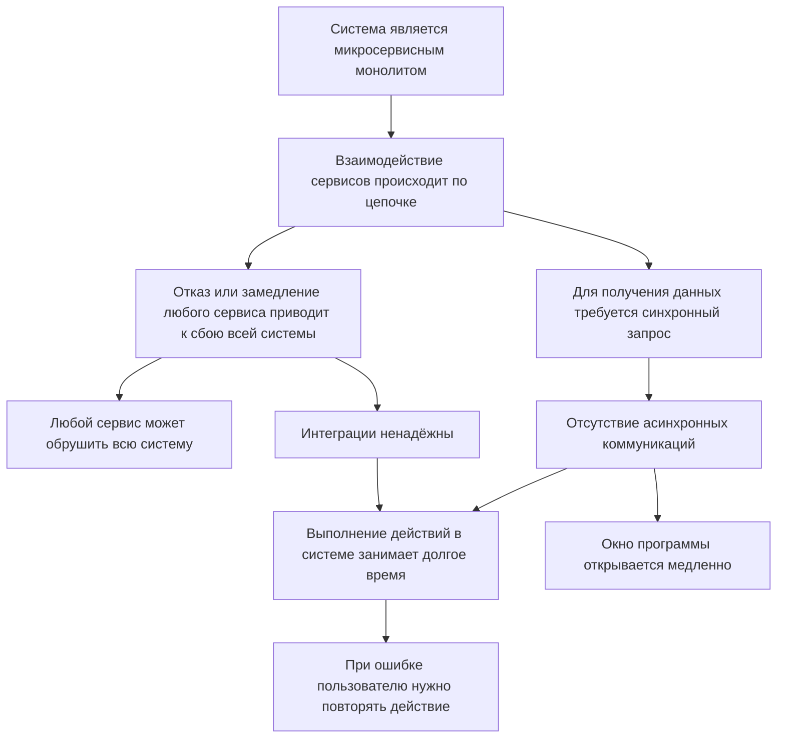

## Дерево текущей реальности

```mermaid
graph TD
    A[Система является микросервисным монолитом] --> B[Взаимодействие сервисов происходит по цепочке]
    B --> C[Отказ или замедление любого сервиса приводит к сбою всей системы]
    B --> D[Для получения данных требуется синхронный запрос]
    C --> E[Любой сервис может обрушить всю систему]
    C --> F[Интеграции ненадёжны]
    D --> G[Отсутствие асинхронных коммуникаций]
    G --> H[Выполнение действий в системе занимает долгое время]
    G --> I[Окно программы открывается медленно]
    F --> H
    H --> J[При ошибке пользователю нужно повторять действие]
```
